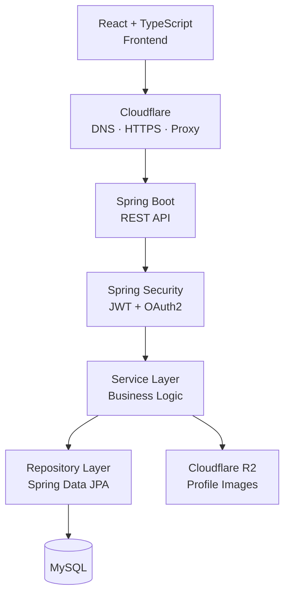

<div align="center">

# AuthForge

### Production-Oriented Authentication & Authorization Platform

Reusable auth infrastructure built with **Spring Boot · Spring Security · React · TypeScript · MySQL**

[]()
[]()
[]()
[]()
[](https://authforge.in)

</div>

---

AuthForge is a **full-stack, reusable authentication and authorization platform**. It provides a secure, extensible foundation for authentication, authorization, session management, user management, and account security — so applications can integrate these capabilities instead of implementing them from scratch.

Email/password login, JWT access tokens, refresh-token sessions, OAuth2 (Google & GitHub), role-based authorization, OTP-based password recovery, transactional email, and protected frontend routes are unified under a single, layered architecture.

> AuthForge is designed as a reusable security foundation — not a one-off login page — intended to sit underneath future applications.

## Table of Contents

- [Features](#features)
- [Tech Stack](#technology-stack)
- [Architecture](#architecture)
- [Getting Started](#getting-started)
- [Authentication Flow](#authentication-flow)
- [Authorization & RBAC](#authorization--role-based-access-control)
- [Password Recovery](#password-recovery--account-security)
- [User & Profile Management](#user--profile-management)
- [Email Services](#email--notification-services)
- [Database Design](#database-design--data-model)
- [Backend Structure](#backend-architecture--project-structure)
- [Security & Validation](#security--validation)
- [Roadmap](#roadmap)
- [Contributing](#contributing)
- [License](#license)

## Features

### Authentication
- Email/password registration and login, BCrypt password hashing
- JWT access tokens + refresh-token session management
- Secure cookie-based refresh-token handling
- Logout and session invalidation
- Automatic access-token renewal on the frontend

### OAuth2
- Google and GitHub login, unified with local-account authentication
- Provider tracking for `LOCAL`, `GOOGLE`, and `GITHUB` accounts

### Authorization
- Role-based access control with multiple roles per user
- `ROLE_GUEST` and `ROLE_ADMIN`, with role-protected backend endpoints

### Password & Account Security
- Authenticated password change (current-password verification required)
- Forgot-password flow with 6-digit, BCrypt-hashed OTPs
- OTP expiration, attempt limits, resend cooldown, and user-enumeration protection
- One-time password-reset tokens; refresh-token revocation on password change

### User & Profile Management
- Profile updates, account status tracking, profile images, account deletion
- Authentication-provider visibility per account

### Email Services
- Welcome emails, password-reset OTP emails, SMTP delivery, HTML templates

### Frontend
- React + TypeScript, protected routes, Zustand auth state, Axios interceptor
  with automatic token refresh and request retry, toast notifications, animated UI

### API & Maintenance
- OpenAPI/Swagger docs, centralized exception handling, scheduled cleanup of
  expired auth data, layered Controller → Service → Repository architecture

## Technology Stack

### Backend
| Technology | Purpose |
|---|---|
| Java | Core backend language |
| Spring Boot | Application framework |
| Spring Security | Authentication and authorization |
| Spring Data JPA / Hibernate | Persistence and ORM |
| MySQL | Relational database |
| JWT (HS512) | Access-token authentication |
| OAuth2 | Google and GitHub login |
| Spring Mail | Email delivery |
| SpringDoc OpenAPI | API documentation |

### Frontend
| Technology | Purpose |
|---|---|
| React + TypeScript | UI, type-safe application logic |
| Vite | Build and dev tooling |
| Tailwind CSS + shadcn/ui | Styling and reusable components |
| Zustand | Auth/app state management |
| Axios | HTTP client, token refresh interceptor |
| Framer Motion / Lucide | Animation and icons |

### Infrastructure
| Technology | Purpose |
|---|---|
| Oracle Cloud | App and database hosting |
| Cloudflare | DNS, HTTPS, proxy |
| Cloudflare R2 | Profile-image object storage |
| Custom domain | `authforge.in` |

## Architecture



Each layer has one job: **Controller** handles HTTP in/out, **Service** owns business logic, **Repository** owns persistence, **Security** owns JWT/OAuth2/authorization, and **Exception Handling** normalizes errors across all of it. See [Backend Structure](#backend-architecture--project-structure) for the full breakdown.

### Design Principles
- Separation of concerns across API, business logic, and persistence
- Reusable, provider-agnostic authentication components
- Secure session management as a first-class concern, not an add-on
- Extensible for additional auth providers and roles without rearchitecting

## Getting Started

> Adjust paths/commands to match your actual repo layout and scripts.

**Prerequisites:** Java 17+, Node 18+, MySQL 8+, a Google/GitHub OAuth2 app (optional, for social login), an SMTP provider (e.g. Gmail App Password).

### 1. Clone and configure
```bash
git clone https://github.com/<your-username>/authforge.git
cd authforge
```

### 2. Backend setup
```bash
cd backend
cp src/main/resources/application.example.yml src/main/resources/application.yml
```
Set the following environment variables (or fill in `application.yml` directly):
```env
DB_URL=jdbc:mysql://localhost:3306/authforge
DB_USERNAME=root
DB_PASSWORD=your_password

JWT_SECRET=replace_with_a_long_random_secret
JWT_ACCESS_TOKEN_EXPIRY=15m
JWT_REFRESH_TOKEN_EXPIRY=7d

GOOGLE_CLIENT_ID=your_google_client_id
GOOGLE_CLIENT_SECRET=your_google_client_secret
GITHUB_CLIENT_ID=your_github_client_id
GITHUB_CLIENT_SECRET=your_github_client_secret

SMTP_HOST=smtp.gmail.com
SMTP_PORT=587
SMTP_USERNAME=your_email@gmail.com
SMTP_PASSWORD=your_app_password

CLOUDFLARE_R2_BUCKET=authforge-profile-images
CLOUDFLARE_R2_ACCESS_KEY=...
CLOUDFLARE_R2_SECRET_KEY=...
```
```bash
./mvnw spring-boot:run
```
Backend runs on `http://localhost:8080` by default. API docs at `http://localhost:8080/swagger-ui.html`.

### 3. Frontend setup
```bash
cd frontend
npm install
cp .env.example .env   # set VITE_API_BASE_URL=http://localhost:8080
npm run dev
```

### 4. Database
Run any provided migration scripts, or let Hibernate auto-create the schema in a dev profile. Core tables: `users`, `roles`, `user_roles`, `refresh_tokens`, `password_reset_otps`, `password_reset_tokens`.

## Authentication Flow

### Email & Password Login
```text
React Frontend → Login API → Spring Security → Validate Credentials → MySQL User
    → Generate JWT Access Token
        ├─► Create & Store Refresh Token
        └─► Secure Refresh-Token Cookie → Authenticated React Session
```
1. User submits email and password.
2. Spring Security validates credentials against the stored user.
3. A short-lived JWT access token is issued.
4. A refresh token is created and persisted in MySQL.
5. The refresh token is set as a secure cookie; the frontend session is established.

### Automatic Token Refresh
```text
React API Request → Attach Access Token → Backend Validation
    ├── Valid ──────► Process Request
    └── Expired ────► Refresh Endpoint → Validate Refresh Token
                        → Issue New Access Token → Retry Original Request
```

### OAuth2 Authentication
```text
React Frontend → Google / GitHub → OAuth2 Callback → Find or Create User
    → Assign Application Role → Issue AuthForge JWT Session → Authenticated React Session
```
OAuth2 users share the same authentication architecture as local users, tracked via provider + provider ID, and default to `ROLE_GUEST`.

### Logout & Session Revocation
Logout revokes the active refresh token. Refresh tokens are also revoked wholesale on sensitive events (password change/reset), so a stolen refresh session can't outlive a credential rotation.

## Authorization & Role-Based Access Control

| Role | Description |
|---|---|
| `ROLE_GUEST` | Default role for normal users |
| `ROLE_ADMIN` | Administrative functionality |

Users hold roles via a **many-to-many** relationship, so additional roles can be introduced without touching the core auth architecture.

```text
Authenticated User → Load User & Roles → Spring Security → Check Required Authority
    ├── Allowed ─► Process Request
    └── Denied ──► 403 Forbidden
```

Authorization is enforced **at the backend** — frontend route protection is a UX layer only, never the security boundary.

## Password Recovery & Account Security

```text
Request Reset → Enter Email → Generate OTP → Hash & Store OTP → Send via Email
    → Verify OTP → Generate Reset Token → Set New Password → Revoke Existing Sessions
```

**OTP protection:** 6-digit, cryptographically secure, BCrypt-hashed, 5-minute expiry, max 5 attempts, one-time use, new OTP invalidates the old one, resend cooldown, no email-enumeration leakage.

**Reset token protection:** lookup ID + BCrypt-hashed secret, ~10-minute expiry, one-time use, auto-cleanup after use/expiry.

**Password change (authenticated):** requires current-password verification → new password hashed → all existing refresh tokens revoked → user must re-authenticate on other devices.

## User & Profile Management

Each account stores a UUID, display name, email (identity — not editable via profile update), password hash (local accounts only), profile image reference, enabled/disabled status, provider + provider ID, roles, and timestamps. All API responses go through DTOs rather than exposing entities directly.

OAuth2 accounts have no local password, so password-specific operations are disabled for them automatically based on provider.

**Account deletion** removes refresh tokens first (avoiding FK conflicts and stale sessions), then the user record; the frontend clears state and redirects.

**Profile images** are planned to route through Cloudflare R2 via `images.authforge.in`, with the user record storing only the reference.

## Email & Notification Services

SMTP-based delivery (Gmail App Password supported for dev) handles:
- Welcome email after registration
- Password-reset OTP email

Both flows route through a centralized `EmailService` on the backend — credentials and delivery logic never touch the frontend. For production, configure SPF, DKIM, and DMARC on the sending domain for deliverability.

## Database Design & Data Model

| Table | Purpose |
|---|---|
| `users` | Account and profile data |
| `roles` | Available application roles |
| `user_roles` | User ↔ role mapping (many-to-many) |
| `refresh_tokens` | Persistent refresh-token sessions (JTI, expiry, revocation, replacement chain) |
| `password_reset_otps` | OTP records for recovery |
| `password_reset_tokens` | Temporary post-OTP reset tokens |

All sensitive secrets (OTPs, reset-token secrets, passwords) are stored as BCrypt hashes, never plaintext. Refresh tokens are removed before user deletion to preserve referential integrity.

**Scheduled cleanup** runs roughly every 15 minutes, purging used/expired OTPs, used/expired reset tokens, and revoked/expired refresh tokens.

## Backend Architecture & Project Structure

```text
Controller  →  REST endpoints, request/response handling
Service     →  Auth, authorization, account & business logic
Repository  →  Spring Data JPA persistence
Entity      →  Persistent data model
DTO         →  API request/response contracts (entities never exposed directly)
Security    →  JWT, OAuth2, authorization, authenticated-user context
Exceptions  →  Centralized auth/API error handling
Scheduled   →  Periodic cleanup of expired security records
```

Controllers stay thin and delegate to services; services coordinate repositories and security components; repositories isolate persistence from business logic. This keeps each layer independently testable and lets new auth providers or roles slot in without touching unrelated code.

## Security & Validation

- **Passwords:** BCrypt via Spring Security's `PasswordEncoder`; never stored or logged in plaintext; current-password re-verification required for changes.
- **JWTs:** HMAC-signed, HS512, validated via a Spring Security filter; invalid/expired tokens are rejected outright.
- **Refresh tokens:** persisted with a unique JTI, expiration, revocation status, and replacement tracking; secure cookie storage; revoked en masse on password change; cleaned up on schedule.
- **Password recovery:** see [above](#password-recovery--account-security) — hashed OTPs/tokens, expiry, attempt limits, one-time use, no enumeration.
- **Authorization:** enforced server-side via Spring Security roles/authorities; the authenticated identity — never a client-supplied user ID — drives profile operations.
- **OAuth2:** Google/GitHub users flow through the same pipeline and receive `ROLE_GUEST` by default.

## Roadmap

Known hardening items for the next iteration:
- API rate limiting and account throttling/lockout
- Stronger password policy enforcement
- CORS and CSRF review, security headers audit
- Audit logging and login tracking
- Additional file-upload validation (profile images)
- Production monitoring/observability

## Contributing

Issues and PRs are welcome. Please open an issue describing the change before submitting a large PR, and keep new endpoints consistent with the existing Controller → Service → Repository layering and DTO boundary.

## License

MIT — see [`LICENSE`](./LICENSE) for details.

---

<div align="center">

Built by **Armaan** · [authforge.in](https://authforge.in)

</div>
